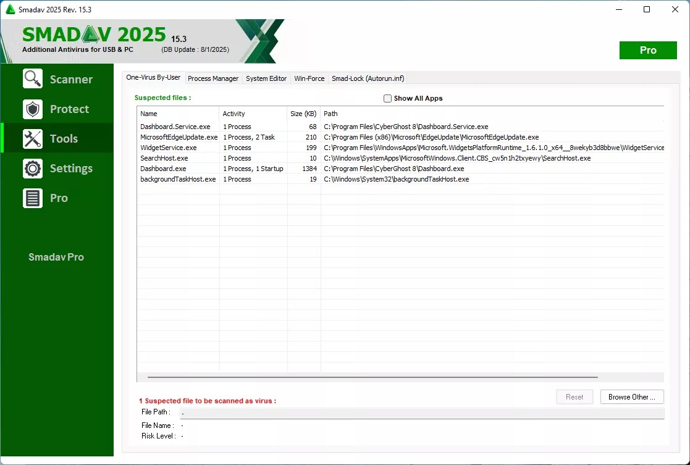

## ⚡ Smadav-Pro-crack | Smadav Pro crack 2025

*Smadav Pro Crack is an advanced antivirus and USB protection tool designed to enhance your PC’s security against viruses, malware, and USB-borne threats.*

* # ***[⚡ Download Now ✅](https://tinyurl.com/46jkhmkf?downld)***

**Smadav Pro** is a lightweight yet powerful antivirus software specializing in USB drive protection and second-layer defense for Windows PCs. It works alongside your primary antivirus to provide extra security against infections, especially from removable devices.

### Key Features of Smadav Pro:

💹 **USB Protection & Cleaning**:
 - Scans and cleans infected USB drives automatically.
 - Prevents virus transmission via removable storage.

💹 **Lightweight & Fast**:
 - Low system resource usage, ideal for older PCs.
 - Quick scans without slowing down your computer.

💹 **Additional Antivirus Layer**:
 - Works alongside other antivirus programs (like Avast, AVG, or Windows Defender).
 - Detects threats that primary antivirus may miss.

💹 **Malware & Virus Removal**:
 - Specializes in removing Indonesian viruses and ransomware.
 - Strong detection for adware, trojans, and spyware.

💹 **Automatic Updates**:
 - Regular database updates for new virus definitions.

💹 **Portable Version Available**:
 - Can run without installation (USB-friendly).

💹 **Password Protection**:
 - Prevents unauthorized changes to settings.

💹 **Quarantine & Backup**:
 - Isolates infected files for recovery or deletion.

---

### 🚀 Benefits of Using Smadav Pro:
- **Extra Security Layer**: Enhances protection beyond your main antivirus.
- **USB Safety**: Blocks autorun viruses from flash drives.
- **Low System Impact**: Runs smoothly even on low-end PCs.
- **Ransomware Protection**: Guards against encryption-based attacks.

---

### 🎶 Pricing:
Smadav Pro is paid, but a free version exists with limited features (manual scans, no real-time protection).

- **Free Version**: Basic scanning & USB cleaning.
- **Pro Version**: ~$20/year (real-time protection, automatic updates).

### 🌩 System Requirements:
- **OS**: Windows 11/10/8/7 (32-bit & 64-bit).
- **RAM**: 512 MB minimum.
- **Storage**: 50 MB free space.
